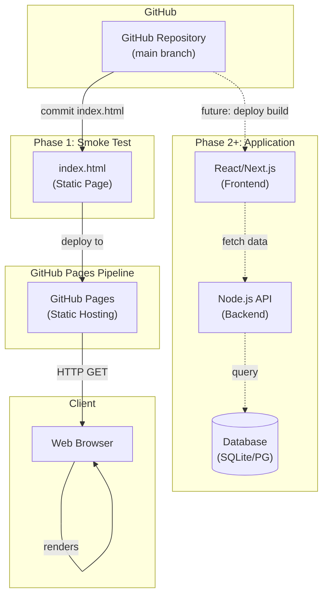
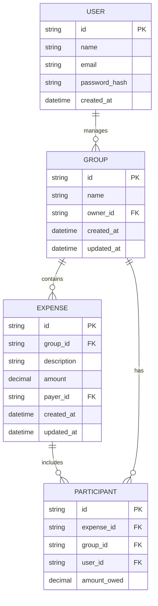
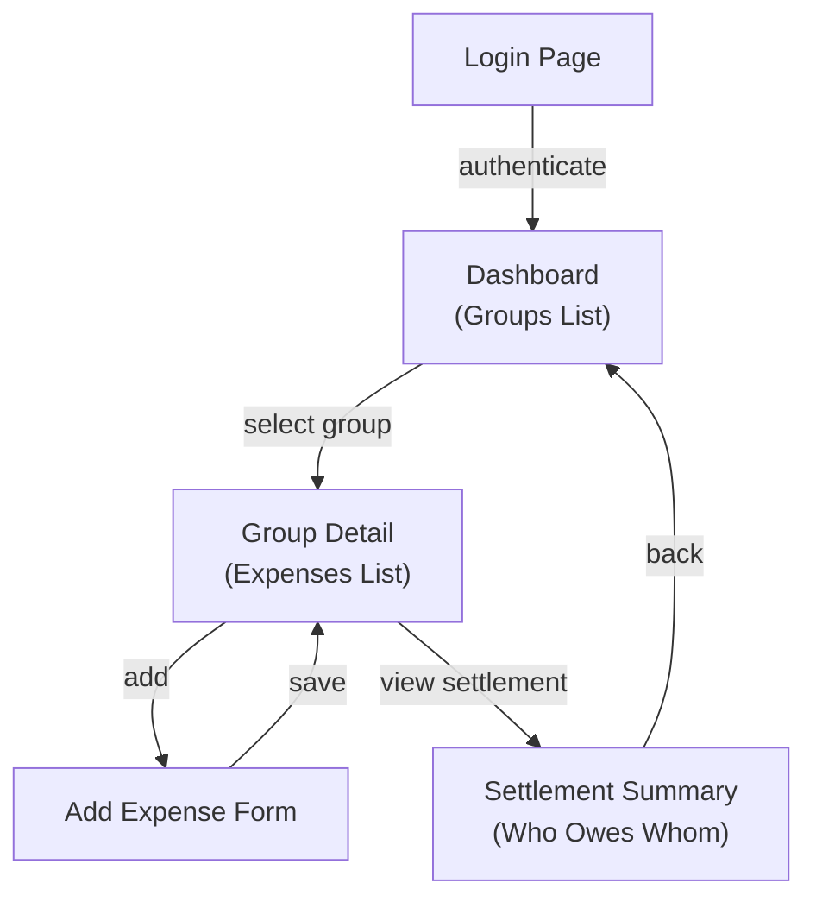

# Architecture — Expense Splitter

## Overview

**Expense Splitter** is a web application designed to simplify the process of splitting expenses among groups. Users can create expense records, assign participants, and the application calculates who owes whom to settle shared costs fairly.

The initial phase focuses on establishing a robust deployment pipeline via GitHub Pages. This foundational step validates that commits to the main branch automatically deploy to production (https://EshaanGulia.github.io/expense-splitter/), enabling rapid iteration on application features without manual intervention. The smoke test uses a minimal static HTML page to verify the deployment pipeline is functional before adding dynamic application logic.

## System Architecture

The Expense Splitter application follows a phased architecture:

**Phase 1 (Current): GitHub Pages Smoke Test**
- Static HTML landing page (`index.html`) at repository root
- Serves as a proof-of-concept for the deployment pipeline
- No backend services, no build step, no external dependencies
- Demonstrates end-to-end deployment: commit → GitHub Pages → live URL

**Phase 2 (Future): Dynamic Web Application**
- React or Next.js frontend for interactive user interface
- Backend API for expense tracking and settlement calculations
- Database for persistence (SQLite for MVP, potentially PostgreSQL for production)
- Build system (webpack/Next.js) to compile frontend and backend

**Phase 3 (Future): Enhanced Features**
- User authentication and authorization
- Persistent storage of expense records and group information
- Advanced settlement algorithms (minimize transactions)
- Mobile responsiveness and offline support

## Data Model

**Phase 1 (Current)**
No data persistence. Static HTML only.

**Phase 2+ (Future)**

## API Design

**Phase 1 (Current)**
No API. Static HTML file served as-is.

**Phase 2+ (Future)**

### Groups
- `GET /api/groups` — List all groups for authenticated user
- `POST /api/groups` — Create a new group
- `GET /api/groups/:id` — Fetch group details
- `PUT /api/groups/:id` — Update group
- `DELETE /api/groups/:id` — Delete group

### Expenses
- `GET /api/groups/:groupId/expenses` — List expenses in a group
- `POST /api/groups/:groupId/expenses` — Create an expense
- `GET /api/expenses/:id` — Fetch expense details
- `PUT /api/expenses/:id` — Update expense
- `DELETE /api/expenses/:id` — Delete expense

### Settlement
- `GET /api/groups/:groupId/settlement` — Calculate who owes whom

## UI / Frontend

**Phase 1 (Current)**
Minimal static landing page:
- Page title: "Expense Splitter"
- Heading (h1): "Expense Splitter — Coming Soon" (with em-dash U+2014)
- Paragraph (p): "Coming soon. Check back later."
- No interactive elements, no styling, no JavaScript

**Phase 2+ (Future)**

**Key Screens:**
1. **Login** — Email/password authentication
2. **Dashboard** — List user's groups; create new group
3. **Group Detail** — View expenses in a group; add new expenses; see settlement summary
4. **Add Expense** — Form to enter expense details (description, amount, payer, participants)
5. **Settlement Summary** — Calculated balance (who owes whom and how much)

## Technology Stack

| Component | Technology | Rationale |
|-----------|-----------|----------|
| **Version Control** | Git + GitHub | Industry standard; GitHub Pages hosting included |
| **Frontend (Phase 1)** | HTML5 | Minimal smoke test; no framework needed; validates deployment pipeline |
| **Frontend (Phase 2+)** | React or Next.js | Modern, component-based; Server-Side Rendering (SSR) for SEO if needed; Next.js for full-stack JavaScript |
| **Backend (Phase 2+)** | Node.js + Express or Next.js API Routes | Same language as frontend (TypeScript); reduce context switching |
| **Database (Phase 2+)** | SQLite (MVP) → PostgreSQL (Production) | SQLite for rapid prototyping; PostgreSQL for scalability and multi-user concurrency |
| **Hosting (Phase 1)** | GitHub Pages | Free static hosting; automatic deployment from git push; no configuration required |
| **Hosting (Phase 2+)** | Vercel (Next.js) or AWS Lambda + S3 | Vercel integrates seamlessly with Next.js; AWS Lambda for serverless backend |
| **Build Tool** | Next.js (unified) or Webpack + Node.js separately | Next.js combines frontend build and backend API in one framework |
| **Package Manager** | npm (with Node.js) | Standard; lock file for reproducible builds |
| **Language** | TypeScript (Phase 2+) | Type safety reduces bugs; better IDE support and documentation |
| **Testing** | Jest + React Testing Library (frontend), Jest + Supertest (backend) | Standard ecosystem; unit and integration tests |

## Key Technical Decisions

1. **Static HTML for Phase 1 (Smoke Test)**
   - **Decision:** Use a single `index.html` file to validate the GitHub Pages deployment pipeline before building the application.
   - **Rationale:** Validates the entire deployment flow (git commit → GitHub Pages → live URL) with minimal complexity. Separates deployment concerns from application logic. Provides immediate feedback on pipeline health.
   - **Alternative Considered:** Skip smoke test and build the full application immediately. **Rejected because:** Higher risk of deployment failures in production; harder to debug pipeline issues once mixed with application code; doesn't follow the principle of "validate infrastructure before building on it."

2. **GitHub Pages as Primary Hosting**
   - **Decision:** Use GitHub Pages for Phase 1 static content and consider it as a model for future deployments (Vercel for Phase 2+).
   - **Rationale:** Free, automatic deployment from git push, no additional configuration required, tight GitHub integration.
   - **Alternative Considered:** Self-hosted server (AWS EC2) or Heroku. **Rejected because:** Adds operational overhead; GitHub Pages is sufficient for the scope; cost increases unnecessarily.

3. **UTF-8 Encoding with Em-Dash Character**
   - **Decision:** Enforce UTF-8 file encoding and use the em-dash character (U+2014) in the heading.
   - **Rationale:** Em-dash is typographically correct for the "Expense Splitter — Coming Soon" heading; UTF-8 is the web standard; validates that the deployment pipeline preserves character encoding correctly.
   - **Alternative Considered:** Use ASCII hyphen (-) instead of em-dash. **Rejected because:** Misses an opportunity to validate Unicode handling in the deployment pipeline; typographically incorrect for professional appearance.

4. **Minimal HTML5 Boilerplate (No CSS/JavaScript)**
   - **Decision:** Create a bare-minimum HTML5 document with only semantic structure; no CSS, no JavaScript, no external assets.
   - **Rationale:** Focuses the test on the pipeline alone; reduces variables; ensures the page loads instantly. CSS and JavaScript can be added in Phase 2 when the application logic is introduced.
   - **Alternative Considered:** Add basic CSS styling. **Rejected because:** Increases complexity; the goal is to test deployment, not design; styling will be applied when the full application is built.

5. **Single File at Repository Root**
   - **Decision:** Place `index.html` at the repository root (`./index.html`) rather than in a subdirectory (e.g., `docs/index.html` or `public/index.html`).
   - **Rationale:** GitHub Pages is configured to serve from the repository root; placing the file there ensures it serves at the root URL. Simplifies the structure for Phase 1.
   - **Alternative Considered:** Place in a `public/` or `docs/` directory. **Rejected because:** Requires build-system routing or additional GitHub Pages configuration; not necessary for a static file; would complicate the phase-1 smoke test.

6. **No .gitignore Exceptions**
   - **Decision:** Commit `index.html` as a normal file; do not add .gitignore rules.
   - **Rationale:** HTML files should be tracked in version control; no sensitive data or build artifacts in this file. Future build outputs (Phase 2+) may need .gitignore entries, but not Phase 1.
   - **Alternative Considered:** Create a .gitignore file to explicitly allow *.html. **Rejected because:** Unnecessary; .gitignore is only needed when filtering is required (e.g., node_modules, .env).

7. **Future Build System (Phase 2+)**
   - **Decision:** Plan to introduce a build system (Next.js, Webpack, or similar) in Phase 2 without retrofitting Phase 1.
   - **Rationale:** Phase 1 static content remains untouched by the build system; Phase 2+ can replace or extend it as needed. Keeps concerns separate.
   - **Alternative Considered:** Implement a build system now that processes index.html. **Rejected because:** Adds unnecessary complexity; the smoke test should be simple and isolated; build systems will be introduced when application logic requires them.

## Deployment

**Phase 1 (Current)**

1. **Development**
   - Developer edits `index.html` in their local environment.
   - Verifies content locally by opening the file in a browser (optional).

2. **Git Workflow**
   - Stage the file: `git add index.html`
   - Commit with a descriptive message: `git commit -m "Add index.html smoke test for GitHub Pages deployment"`
   - Push to main branch: `git push origin main`

3. **Automated Deployment (GitHub Actions / GitHub Pages)**
   - GitHub detects a push to `main`.
   - GitHub Pages automatically publishes the content to `https://EshaanGulia.github.io/expense-splitter/`.
   - Deployment typically completes within 1-10 minutes.

4. **Verification**
   - User accesses the URL `https://EshaanGulia.github.io/expense-splitter/`.
   - Confirms HTTP 200 response and correct page content.
   - Tests in multiple browsers to ensure rendering consistency.

**Phase 2+ (Future)**

1. **Build System**
   - Source code (React/Next.js, Node.js backend, TypeScript) is committed to `main`.
   - GitHub Actions workflows run automated tests and build the application.

2. **Hosting**
   - Frontend builds to static assets and deploys to a CDN (Vercel, Netlify, or CloudFront).
   - Backend deploys to a serverless platform (Lambda, Cloud Run) or traditional server.
   - Database migrations are applied (PostgreSQL or other persistence layer).

3. **Monitoring**
   - Application health checks, error logs, and performance metrics are collected.
   - Alerts notify the team of deployment failures or production issues.

---

## Summary

The Expense Splitter project is architected in phases:
- **Phase 1:** Validate the GitHub Pages deployment pipeline with a minimal static HTML smoke test.
- **Phase 2:** Introduce a dynamic web application (React/Next.js frontend + Node.js API + database).
- **Phase 3:** Add advanced features (authentication, complex algorithms, mobile responsiveness).

This approach de-risks the deployment pipeline early and provides a foundation for rapid feature development in later phases.